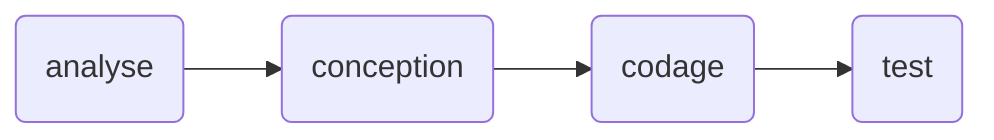
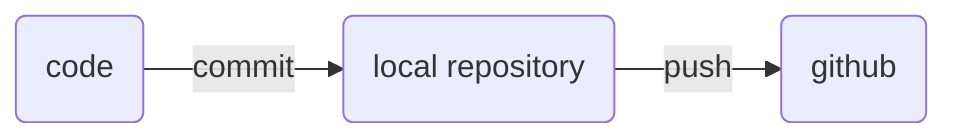

# Cours d'analyse #
## Description ##
## Implementation ##
- codage/programmation
- test
- integration 
- analyse
- conception

## Source Control ##
La gestion du code source.
On utilise git, mais il y a d'autres systèmes (subversion, mercurial).

Le flux de developpement:
